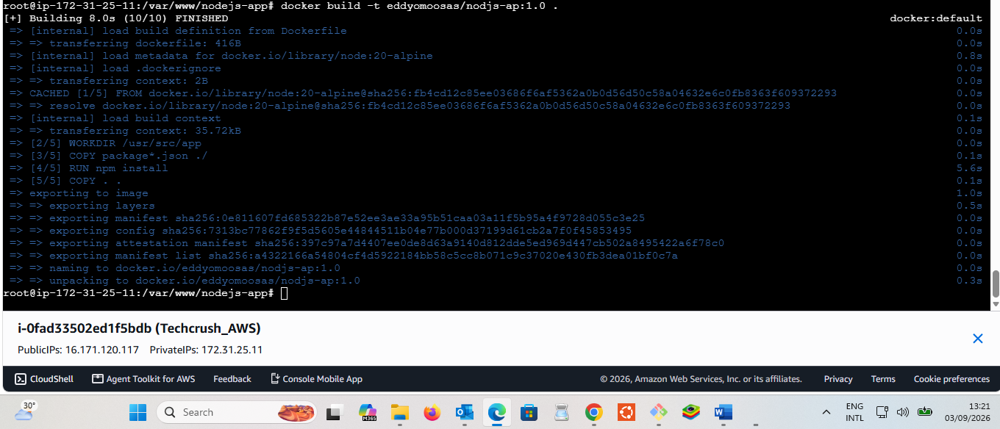
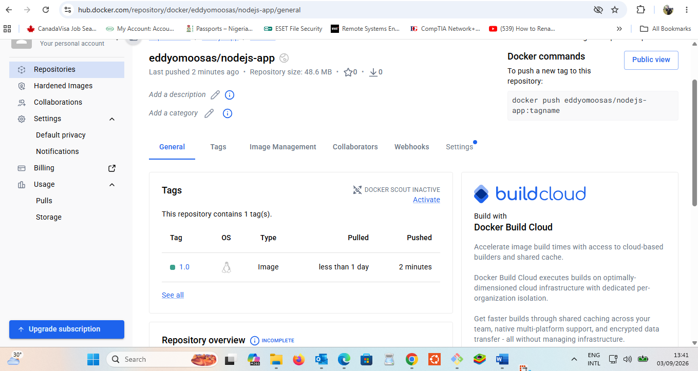
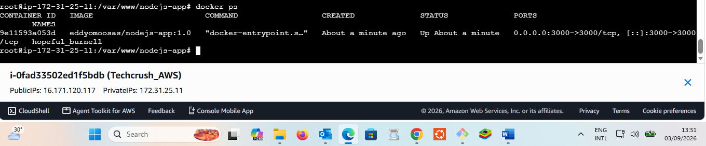
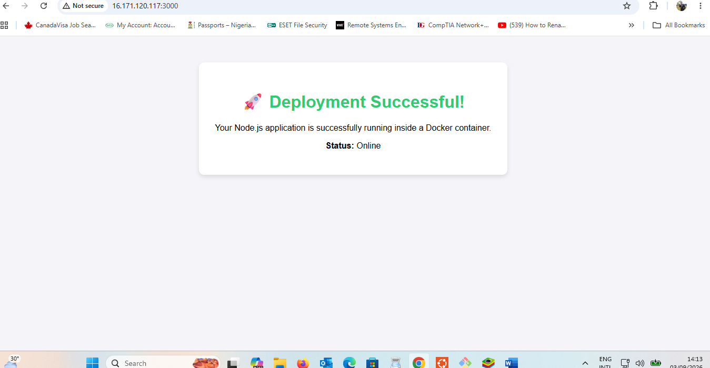

# Node.js & Docker Deployment Assignment

This repository contains a simple Node.js Express application containerized using Docker and deployed onto a Linux server.

## Required Screenshots

### 1. Docker Build Command

### 2. Docker Hub Image

### 3. Running Docker Container

### 4. Live Application

